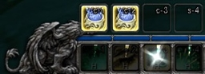

# jButtonFlash

### [Download Latest](https://github.com/fondlez/jButtonFlash/releases/latest)

This is a backport of the jButtonFlash addon from the Legion game version. It
supports the final version clients for Warlords of Draenor (WoD 6.2.4), Mists 
of Pandaria (MoP 5.4.8), Cataclysm (Cata 4.3.4) and Wrath of the Lich King 
(WotLK 3.3.5a).

* This backport is by [fondlez](https://github.com/fondlez/jButtonFlash).
* Original addon is by [jwldnr](https://github.com/woldner/jButtonFlash).

## Description
This simple addon adds an animation to highlight a button on the action bar when 
pressed. 

It is inspired by the old and outdated addon "SnowFallKeyPress", which
was made mostly obsolete when the Cataclysm expansion was launched due to the 
new Interface Combat option called "Cast action keybinds on key down". However, 
the remaining function that highlighted buttons on keypress was missed by many. 
This addon returns that feature in a similar way.

## Example Screenshot

